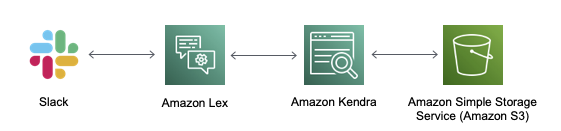

# The Q&A Bot Template
Setting up the initial infrastructure for such a task can be quite daunting.
Therefore, the following instructions will help you setup the initial services.

The Q&A Bot Template consists of three components:
* A Slack Workspace
* Amazon Lex
* Amazon Kendra
  * Amazon S3 to store the FAQ datasets

**Note:** The Amazon Kendra service, is not supported in all regions. Therefore,
you should select on of the supported regions. We recommend using the **EU
(Ireland) | eu-west-1** region. For all the service creations and work that you
are doing, you need to ensure that the correct region is used. This can be done
as follows:
* **Programmatic access:** `export AWS_DEFAULT_REGION=eu-west-1` on the CLI
* **AWS Management Console access:** Select the region in the top right corner

In the following sections, you will find all the information that is needed to
deploy the template. This will be done in the opposite order, than listed above.

1. [Setup Amazon Kendra](./bot-template/amazon-kendra.md)
1. [Setup Amazon Lex](./bot-template/amazon-lex.md)
1. [Setup Slack](./bot-template/slack.md)
