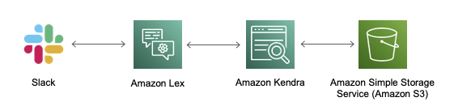

# The Q&A Bot Template
The challenge is about creating a Q&A Bot, that helps travelers retrieve
information about their insurance. The focus is to work in the data science
side, and less on the infrastructure side. Therefore, you will find the
instructions to setup a basic end-to-end implementation of a Q&A bot below.
When you have finished these steps, you will be able to chat with a bot and ask
it some basic questions.

The Q&A Bot Template that you will deploy, consists of the following components:
* A Slack Workspace - to interact with the bot
* Amazon Lex - the AWS service to create conversational interfaces
* Amazon Kendra - an intelligent search service
* Amazon S3 - to store the FAQ datasets

**Note:** The Amazon Kendra service, is not supported in all AWS regions.
Therefore, you should select one of the supported regions. We recommend using
the **EU (Ireland) | eu-west-1** region. For all the service creations and work
that you will be doing, you need to ensure that the correct region is used. This
can be done as follows:
* **Programmatic access:** `export AWS_DEFAULT_REGION=eu-west-1` on the CLI
* **AWS Management Console access:** Select the region in the top right corner

We have split up the deployment and configuration of the single services into
separate sections. In each of them, you find a step-by-step guide. The order of
the deployment, is done in the opposite order, than listed above.

1. [Setup Amazon Kendra](./bot-template/amazon-kendra.md)
1. [Setup Amazon Lex](./bot-template/amazon-lex.md)
1. [Setup Slack](./bot-template/slack.md)
